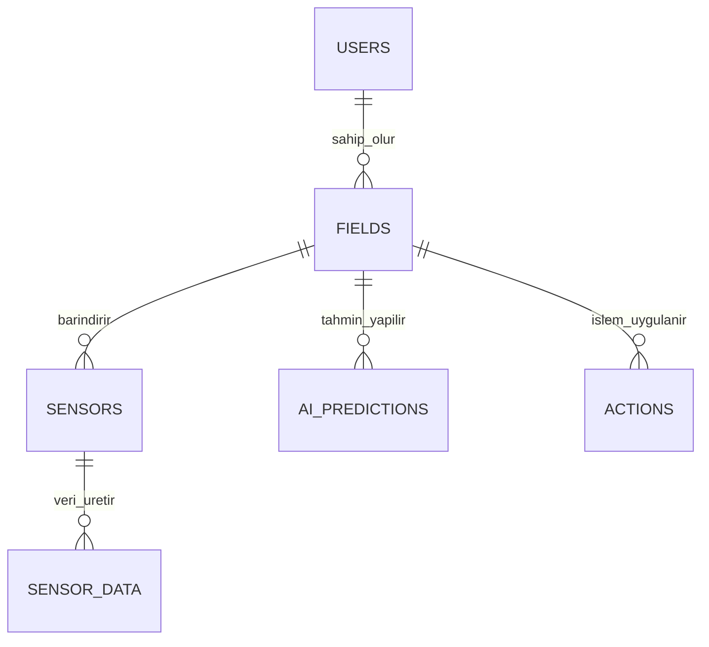

# 🌾 Akıllı Tarım Yönetim Sistemi

**Hazırlayan:** Neva Yıldız  
**Tarih:** 24 Mart 2026  
**Teslim:** 28 Mart 2026  

---

## 📌 Proje Hakkında

Akıllı Tarım Yönetim Sistemi, çiftçilerin tarla verilerini sensörler aracılığıyla takip etmesini ve yapay zeka destekli kararlarla sulama ve gübreleme işlemlerini optimize etmesini amaçlayan bir sistemdir.

---

## 🧱 Veritabanı Şeması (Database Schema)

### 👥 Users (Kullanıcılar)

| Alan | Tip | Açıklama |
|------|-----|--------|
| id | SERIAL | PK |
| full_name | VARCHAR | Ad Soyad |
| email | VARCHAR | Benzersiz |
| password_hash | VARCHAR | Şifre |
| role | VARCHAR | admin / farmer |
| created_at | TIMESTAMP | Kayıt zamanı |

---

### 🌾 Fields (Tarlalar)

| Alan | Tip | Açıklama |
|------|-----|--------|
| id | SERIAL | PK |
| user_id | INT | FK (users) |
| name | VARCHAR | Tarla adı |
| crop_type | VARCHAR | Ürün tipi |
| area_size | NUMERIC | Alan |

---

### 📡 Sensors (Sensörler)

| Alan | Tip | Açıklama |
|------|-----|--------|
| id | SERIAL | PK |
| field_id | INT | FK |
| sensor_type | VARCHAR | nem / sıcaklık |
| status | VARCHAR | active |

---

### 📊 Sensor Data (Veriler)

| Alan | Tip | Açıklama |
|------|-----|--------|
| id | BIGSERIAL | PK |
| sensor_id | INT | FK |
| value | NUMERIC | Ölçüm |
| measured_at | TIMESTAMP | Zaman |

---

### 🧠 AI Predictions

| Alan | Tip | Açıklama |
|------|-----|--------|
| id | BIGSERIAL | PK |
| field_id | INT | FK |
| prediction_type | VARCHAR | sulama |
| confidence | NUMERIC | % |
| created_at | TIMESTAMP | Zaman |

---

### 🚰 Actions (Aksiyonlar)

| Alan | Tip | Açıklama |
|------|-----|--------|
| id | BIGSERIAL | PK |
| field_id | INT | FK |
| action_type | VARCHAR | sulama |
| amount | NUMERIC | Miktar |
| executed_by | VARCHAR | system |

---

## 🔗 ER Diyagramı

---

## ⚡ Performans ve Optimizasyon

### 🚀 İndeksleme
- `sensor_data(sensor_id)`
- `sensor_data(measured_at)`

✔ Sorgu hızını ciddi artırır

---

### 📦 Partitioning (Bölümlendirme)
- `sensor_data` tablosu aylık bölünmeli

✔ Büyük veri performansı artar  
✔ AI modeli daha hızlı çalışır  

---

## 🧠 Kullanılan Teknolojiler

- PostgreSQL
- TensorFlow
- IoT Sensörler
- Backend API (Node.js / Python önerilir)

---

## 🎯 Proje Hedefi

- Su tasarrufu sağlamak  
- Verimi artırmak  
- Otomatik karar mekanizması oluşturmak  

---

